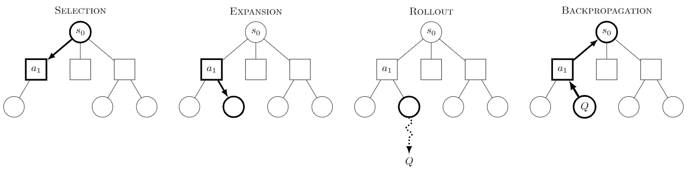

# Fire Simulation

Python-based simulation engine with recommendation module 

## Simulation Config Generator 

Python Script for generating valid map config was provided under `/simulation/configurations/conf_generator.py`.
Script generates full config - with every sensor in sector and 1 Fire Brigate in each sector. 

Map is rectangular in size based on (GRID_SIZE X GRID_SIZE )

Script generates config based on: 
- **Location(LON_START, LAT_START, LON_END, LAT_END)**
- **Grid size**

## Recommendation System 

In order to support the decision-making strategy, Monte Carlo Tree Search (MCTS) was implemented as the core mechanism to optimize the allocation of firefighting resources. The algorithm builds a search tree of possible system states by simulating agent actions, evaluating rewards, and expanding paths. Each node in the tree represents a specific configuration of the forest.



Module is based on: A minimal implementation of Monte Carlo tree search (MCTS) in Python 3
Luke Harold Miles, July 2019, Public Domain Dedication
See also https://en.wikipedia.org/wiki/Monte_Carlo_tree_search
https://gist.github.com/qpwo/c538c6f73727e254fdc7fab81024f6e1

### MCTS - Reward Strategies

A key aspect of the recommendation module was the backpropagation reward calculator. Our solution introduced three calculation strategies that mix different rewards and penalties:

#### Reward Components

- **LOST_SECTOR_PENALTY** – Penalty applied for sectors that have been lost (beyond control)
- **EXTINGUISHED_FIRES_REWARD** – Reward for successfully extinguishing fires
- **SPREAD_PREVENTION_REWARD** – Reward for preventing the fire from spreading
- **BURNED_SECTOR_PENALTY** – Penalty proportional to the amount of burned area
- **SECTOR_FIRE_LEVEL_PENALTY** – Penalty related to the intensity of the fire

#### Reward Configuration Strategies

Three distinct reward configurations were provided as recommendation module test strategies:

- **RewardConfigConservative** – Focuses on minimizing the number of burned sectors
- **RewardConfigAggressive** – Emphasizes reducing the fire intensity (fire level)
- **RewardConfigBalanced** – Balanced approach combining both strategies

Configurations can be found under `./recommendation/reward_strategies.py` and `./recommendation/reward_calculator.py`

### MCTS - Child Selection Policies for Fire Brigade Dispatcher

Different strategies were tested to determine which would be the most optimal. The implemented strategies were:

#### Dispatch Strategies

- **Greedy Assignment** – Each fire brigade chooses the closest sector with active fire
- **Coordinated Assignment** – Groups of agents were created and sent to the most threatened sector
- **Probabilistic** – Random assignment with sector threat calculation

#### Threat Calculation

Threat was calculated using the following formula:

```
threat = s.fire_level × (1 + s.burn_level)
```

Where:
- `s.fire_level` represents the intensity of the fire in the sector
- `s.burn_level` represents the current burn damage level of the sector

## Testing Recommendation System

### Prerequisites

Since the recommendation and simulation modules share the same models, you need to install the project in development mode:

```sh
pip install -e .
```

Run this command from the main project directory.

### Configuration

The `/recommendation/configs` directory contains basic forest map descriptions and test configurations.

### Test Parameters

The recommendation module test uses the following default parameters:

| Parameter | Value | Description |
|-----------|-------|-------------|
| **CONFIG_PATH** | `" /recommendation/configs/forest_4x4_conf_20250607_164147.json"` | Path to the forest configuration file |
| **NUMBER_OF_SIMULATED_FIRES** | `2` | Number of fires to simulate simultaneously |
| **NUMBER_OF_MAX_SEARCH_STEPS** | `3` | Maximum MCTS search depth |
| **MAX_SIMULATION_TIME** | `4` | Maximum simulation time steps |

### Running Tests

You have two options to run the recommendation system tests:

#### Option 1: Using the test function
```python
run_mcts_test()  
```

#### Option 2: Using the command line
```sh
python3 mcts_test.py
```

#### Validation Output

The system validates predictions by printing the simulation state after `NUMBER_OF_MAX_SEARCH_STEPS` in two scenarios:

1. **WITH recommended actions applied** 
2. **WITHOUT recommended actions applied**

This allows you to evaluate the effectiveness of the MCTS recommendations by comparing:
- Fire spread reduction/Sector damage mitigation  
- Overall resource utilization efficiency
